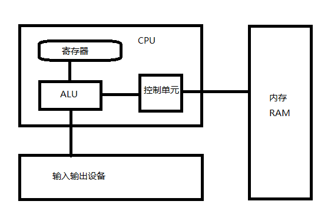
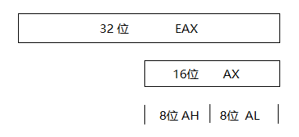

## 抽象层次

- 简单模型

        恶意代码作者--高级编程语言
                    |
                    |编译器 
                    |
                CPU 机器码
                    |
                    | 反汇编器
                    |
        恶意代码分析师 低级汇编语言

通常，计算机系统被描述为以下六个抽象层次，我们自底向上列举。一个抽象层次越低，它的跨系统移植性就越差。

- 硬件  

    硬件是唯一的一个物理层，由电子电路组成。这些电路实现了 `XOR` 门、`AND` 门、 `OR`门 和 `NOT` 门等逻辑运算器的复杂组合，称为 数字逻辑。

- 微指令

    微指令层又称为固件（`firmware`）。微指令只能在为它设计的特定电路上执行，从更高的机器码层翻译而来，提供了访问硬件的接口。因为微指令通常是为了特定的计算机硬件设计的，所以分析恶意代码时我们通常不关心微指令。

- 机器码

    机器码由操作码(`opcode`)组成。[操作码：十六进制数字，告诉处理器想要它做什么]  
    机器码一般由多条微指令实现，而机器码本身是由高级语言程序编译而来。

- 低级语言

    计算机体系结构指令集的人类易读版本，主要指汇编。`Hint`：得不到高级语言源码时，汇编语言是从机器码中能 可信 并 保持一致地 还原得到地最高一层语言。

- 高级语言

    高级语言经过 编译器编译 转化为 机器码。 `C/C++`

- 解释性语言

    这一层的代码不会编译为机器码，而是被翻译成了 字节码。
    字节码 `bytecode` 是特定于该语言的一种中间表示，在 解释器 中执行。
    解释器 `interpreter` 运行时将 字节码 翻译为 可执行代码。  解释器 独立于操作系统，自己处理错误和管理内存。
    `C#` / `Perl` / `.NET` / `Java`

----

## 逆向工程

恶意代码在磁盘上通常是二进制机器码。

反汇编恶意代码 使用反汇编器 `disassembler` 将二进制恶意代码作为输入 输出汇编语言

`x86` 又称 `Intel IA-32`,是大部分32位`PC`使用的体系结构，微软目前所有的32位`Windows`系统都运行在x86上，大部分运行在`AMD 64`和`Intel 64` 体系结构上的`Windows`也都支持`x86`的32位二进制程序。

----
## x86体系结构

难得我自己画个图 

大部分现在计算机体系结构（包括x86)在内部实现上遵循 冯·诺依曼 结构。如下图，包含3种硬件组件。如下图。

- 中央处理单元 `CPU`， 负责执行代码。

    - 控制单元 `control uni`t 使用 指令指针寄存器 `instruction pointer register`  从内存中取得要执行的指令[这个寄存器存有指令的地址]。
    - 寄存器是`CPU`中数据的基本存储单元。
    - 算术逻辑单元 `arithmetic logic unit` `ALU` 执行从内存中取来的指令，并将结果放到寄存器or内存。

- 内存 `RAM`，负责存储所有数据和代码。

- 输入/输出系统(`I/O`)，为键盘、硬盘、显示器等设备提供接口。





### 内存


- 栈 

    用于函数的局部变量和参数，以及控制程序执行流。

- 堆

    动态内存分配，创建（分配）新的值，消除（释放）不再需要的值。--动态内存 `dynamic memory`

- 代码

    代码节包含了在执行程序时`CPU` 所取得的指令。

- 数据

    数据节 `data section` 。 程序初始加载时放入一些值--静态值 `static value`、全局值 `global value`


### 指令

指令 = 助记符 + 零个或多个操作数

指令格式


| 助记符   | 目标操作数 | 源操作数 |
| :-------:| :------:  |:------: |
| mov      |  ecx      |  0x42   |

### 操作码和字节序

|   指令  |   mov ecx |   0x42    |
|  ：---：|   ：---： | ：---：   |
|   操作码 |   B9  |   42 00 00 00 |

如表，指令 `mov ecx,0x42` 的操作码是 `B9 42 00 00 00` . `0xB9` 对应 `mov ecx`， `0x42000000` 对应 `0x42`这个值。

x86 架构使用 小端字节序。

### 操作数

操作数说明指令要使用的数据。

- 立即数 `immediate`  如`0x42`
- 寄存器 `register` 如`ecx`
- 内存地址 `memory address` 一般由方括号内包含值、寄存器或方程， 如 `[eax]`

### 寄存器

四类寄存器：

- 通用寄存器 。`CPU`在执行期间使用。

    `eax`( `ax`, `ah`, `al`)  、  `ebx`( `bx`, `bh`, `bl`)  、 `ecx`( `cx`, `ch`, `cl`) 、  `edx`( `dx`, `dh`, `dl`) 、  `ebp`( `bp`)  、   `esp`( `sp`)  、   `esi`( `si`)

    通用寄存器均32位，可以以16位or32位引用。`eax`、`ebx`、`ecx`、`edx` 还可以分`ah` 和 `al`。举例下图：

    

    通用寄存器一般用于存储数据或内存地址。

    乘法和除法只能使用`EAX` 和 `EDX`。 `EAX`经常存储函数调用的返回值。
    
- 段寄存器 用于定位内存节

    `cs` 、 `ss` 、 `ds` 、 `es` 、 `fs` 、 `gs`

- 标识寄存器
    状态标志  用于作出决定  `eflags`
    在 x86中， eflags为32位，每一位是一个标志，表示置位（置1）或者清除（清0）
    - ZF zero flag 当一个运算的结果等于零时， ZF 被置位， 否则被清除
    - CF carry flag 当一个运算结果相对于目标操作数太大或太小时，CF被置位，否则被清除
    - SF sign flag 当一个运算结果为负数时，SF被置位，若结果为正数，SF被清除。算术运算中，运算结果最高位为1，SF也会置位。
    - TF trap flag TF被置位时，x86处理器每次只能处理一条指令。用于调试。

- 指令指针  用于定位要执行的下一条指令  `eip`，也叫 程序计数器
    当你控制了EIP,你也就控制了CPU将要执行什么

### 简单指令

由方括号括起来 表示对内存中数据的应用 [ebx]表示指向内存中地址为EBX的数据
lea load effective address -- lea destination source


mov eax, [ebx+8] 将从内存中取得的值0x20赋给eax
lea eax, [ebx+8] 将0xB30048这个值赋给eax

**算术运算**
加法 add destination, source
减法 sub destination, source   //如果目标操作数 比要减去的值 小 CF置位

**NOP指令**
什么都不做，执行下一条指令

### 栈

x86有对栈的内建支持，ESP/EBP
ESP 栈指针
EBP
**函数调用**


栈被分配为自顶向下，高地址先被使用。x86的栈布局如上图。


如上图，函数执行时EBP的值始终为0x12F03C,所以，可以用EBP来引用局部变量和参数。Old EBP 即调用者栈帧的EBP值


### 条件指令
- test
    test AND
- cmp


### 分支指令

| 指令 | 描述|
|：----|：----|
|


### 重复指令

rep指令终止条件

| 指令 | 描述 |
|：--- |：--- |
|rep|
|repe,repz|
|repne,repnz|


### C语言主函数和偏移

```c
int main(int argc, char ** argv){....}
```


### 更多信息 Intel x86 Architecture Manual


